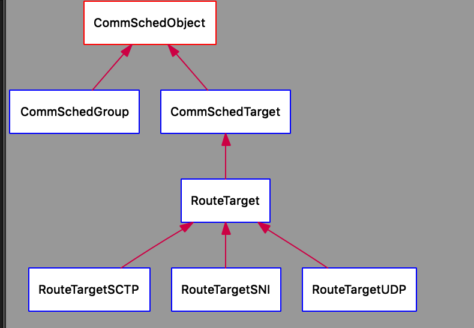

# workflow 源码解析 04 : http 

我们由最简单的例子来分析一下http的流程

我们gdb启动最简单的demo

https://github.com/chanchann/workflow_annotation/blob/main/demos/07_http/http_req.cc

首先我们创建出http task

然后task->start()起来

```cpp
template<class REQ, class RESP>
class WFNetworkTask : public CommRequest
{
public:
	/* start(), dismiss() are for client tasks only. */
	void start()
	{
		assert(!series_of(this));
		Workflow::start_series_work(this, nullptr);
	}
    ...
};
```

我们所有的task都在series中进行，所以我们不能让这个裸的task执行，先给他创建series_work

```cpp
inline void
Workflow::start_series_work(SubTask *first, series_callback_t callback)
{
	new SeriesWork(first, std::move(callback));
	first->dispatch();
}
```

我们先来观察一下SeriesWork的结构

```cpp

class SeriesWork
{
....
protected:
	void *context;
	series_callback_t callback;
private:
	SubTask *first;  
	SubTask *last;   
	SubTask **queue;  
	int queue_size;
	int front;
	int back;
	bool in_parallel;
	bool canceled;
	std::mutex mutex;
};

```

所以我们在new 构造的时候，初始化一下

```cpp
SeriesWork::SeriesWork(SubTask *first, series_callback_t&& cb) :
	callback(std::move(cb))
{
	this->queue = new SubTask *[4];
	this->queue_size = 4;
	this->front = 0;
	this->back = 0;
	this->in_parallel = false;
	this->canceled = false;
	first->set_pointer(this);
	this->first = first;
	this->last = NULL;
	this->context = NULL;
}
```

注意我们这里first->set_pointer(this); 把subTask和这个SeriesWork绑定了起来

然后第一个任务，dispatch

我们从create_http_task中知道，我们创建的task其实是ComplexHttpTask

而ComplexHttpTask继承自WFComplexClientTask<HttpRequest, HttpResponse>

需要注意的是SubTask要求用户实现两个接口，dispatch和done。

而我们在WFComplexClientTask中实现。其中我们first->dispatch()调用的就是这个地方

```cpp
template<class REQ, class RESP, typename CTX>
void WFComplexClientTask<REQ, RESP, CTX>::dispatch()
{
	switch (this->state)
	{
	case WFT_STATE_UNDEFINED:  // 这个状态走了
		if (this->check_request())  // 这里直接return true
		{
			if (this->route_result_.request_object)  // 这里是NULL
			{
	case WFT_STATE_SUCCESS:
				this->set_request_object(route_result_.request_object);
				this->WFClientTask<REQ, RESP>::dispatch();
				return;
			}
            // 所以直接过来了，产生route做dns解析
			router_task_ = this->route();
			series_of(this)->push_front(this);
			series_of(this)->push_front(router_task_);
		}

	default:
		break;
	}

	this->subtask_done();
}
```

我们知道了怎么插入dns解析之一部分

但是dns部分我们忽略，等到dns章节解析时候再来详细分析,


从图中我们可知WFRsolverTask dispatch，创建dns task进行域名解析

而右边部分则是我们http 请求任务了

看名字就可以看出，从CommRequest::dispatch就是发送req

我们gdb跟踪一下这个函数, 第一次bt发现是WFResolverTask, 第二次还是WFResolverTask

todo : 仔细分析为什么是两次

第三次才算到发消息

```
#0  CommRequest::dispatch (this=0x55555586fad0) at /home/ysy/workflow/src/kerne
l/CommRequest.cc:38
#1  0x00005555555d8112 in Communicator::handle_incoming_reply (this=0x555555858
448 <__CommManager::get_instance()::kInstance+8>, res=0x7fffe4000dc0) at /home/
ysy/workflow/src/kernel/Communicator.cc:691
#2  0x00005555555d823d in Communicator::handle_read_result (this=this@entry=0x5
55555858448 <__CommManager::get_instance()::kInstance+8>, res=res@entry=0x7fffe
4000dc0) at /home/ysy/workflow/src/kernel/Communicator.cc:708
#3  0x00005555555d9dfb in Communicator::handler_thread_routine (context=context
@entry=0x555555858448 <__CommManager::get_instance()::kInstance+8>) at /home/ys
y/workflow/src/kernel/Communicator.cc:1093
#4  0x00005555555f0cdd in __thrdpool_routine (arg=0x55555586c380) at /home/ysy/
workflow/src/kernel/thrdpool.c:72
#5  0x00007ffff7bbb6db in start_thread (arg=0x7ffff4523700) at pthread_create.c
:463
#6  0x00007ffff6beb71f in clone () at ../sysdeps/unix/sysv/linux/x86_64/clone.S
:95
```

我们这里自己思考下，如果我们要发get请求，怎么做？

我们肯定要先connect，然后把发送请求，因为是异步，我们得把这个接收事件给epoll监听上

所以我们先从CommRequest::dispatch()看起

## CommRequest::dispatch 组成

```cpp
void CommRequest::dispatch()
{
	// 发送请求
	this->scheduler->request(this, this->object, this->wait_timeout,
								 &this->target);
	...
}

```

首先这里关注两点

1. 首先CommRequest 继承自SubTask和CommSession

说明CommRequest是一个SubTask，又满足CommSession的特性

CommSession是一次req->resp的交互，主要要实现message_in(), message_out()等几个虚函数，让核心知道怎么产生消息。

```cpp
class CommRequest : public SubTask, public CommSession
```

2. 这里的scheduler是CommScheduler

看名字像是调度器

## 我们这里有个疑问了，这个CommRequest，scheduler 是什么时候构造出来的呢？

唯一的入口在构造WFNetworkTask的时候

```
// perl calltree.pl "CommRequest" "" 1 1 2

CommRequest
└── WFNetworkTask     [vim src/factory/WFTask.h +326]
```

```cpp
// src/factory/WFTask.h
WFNetworkTask(CommSchedObject *object, CommScheduler *scheduler,
				std::function<void (WFNetworkTask<REQ, RESP> *)>&& cb) :
	CommRequest(object, scheduler),
	callback(std::move(cb))
{
	... 一些初始化
}
```


我们可以看出

我们的ClientTask就是继承自WFNetworkTask

所以我们在创建task的时候，这些东西就都创建了

而我们的scheduler顾名思义，一个调度器，肯定是个全局调度，得是个单例

我们的单例是__CommManager，他是其中的一个组合模式的成员，生命周期相同

```cpp
CommScheduler *WFGlobal::get_scheduler()
{
	return __CommManager::get_instance()->get_scheduler();
}
```

```cpp
class __CommManager
{
public:
	CommScheduler *get_scheduler() { return &scheduler_; }
	...
private:
	__CommManager():
		io_server_(NULL),
		io_flag_(false),
		dns_manager_(NULL),
		dns_flag_(false)
	{
		const auto *settings = __WFGlobal::get_instance()->get_global_settings();
		if (scheduler_.init(settings->poller_threads,
							settings->handler_threads) < 0)
			abort();

		signal(SIGPIPE, SIG_IGN);
	}
private:
	CommScheduler scheduler_;
	...
};
```

所以在生成__CommManager单例的时候，构造了CommScheduler并初始化

之前章节我们就已经跟到这里过，__CommManager单例第一次实例化的时候，CommScheduler init，然后Communicator init, 产生poller线程和线程池，并启动了poller线程。

## CommRequest::dispatch 函数中需要的参数(CommSchedObject，CommTarget)

回到此处

```cpp
void CommRequest::dispatch()
{
	// 发送请求
	this->scheduler->request(this, this->object, this->wait_timeout,
								 &this->target);
	...
}

```

这里就做一件事scheduler->request，其中需要CommSchedObject，CommTarget



从WFNetworkTask中可以看出，CommSchedObject是传进来的，最开始在构造的时候，传入的是NULL

```cpp
	WFComplexClientTask(int retry_max, task_callback_t&& cb):
		WFClientTask<REQ, RESP>(NULL, WFGlobal::get_scheduler(), std::move(cb))
	{
		...
	}
```

而什么时候才初始化呢? 在WFComplexClientTask的dispatch中set_request_object

```cpp
template<class REQ, class RESP, typename CTX>
void WFComplexClientTask<REQ, RESP, CTX>::dispatch()
{
	switch (this->state)
	{
	case WFT_STATE_UNDEFINED:
		if (this->check_request())
		{
			if (this->route_result_.request_object)
			{
	case WFT_STATE_SUCCESS:
				this->set_request_object(route_result_.request_object);
				this->WFClientTask<REQ, RESP>::dispatch();
				return;
			}
	...
}
```

这里如何产生的route_result_.request_object，是通过dns去做的，这里先略过，在dns那一节详细阐述。

可以看出我们给个url，dns解析出来之后，我们有了request的目标了

而CommTarget是通讯目标，基本上就是ip+port, 还有两个超时参数。连接池什么的都在target里。

CommTarget是在`scheduler->request()`中生成的

```cpp
int request(CommSession *session, CommSchedObject *object,
				int wait_timeout, CommTarget **target)

```

这里参数是CommTarget **target，是一个传出参数

## 仔细解析scheduler->request

```cpp
int request(CommSession *session, CommSchedObject *object,
			int wait_timeout, CommTarget **target)
{

	...
	*target = object->acquire(wait_timeout);
	...
	this->comm.request(session, *target);

}
```

就做两件事，一件事获取target，一件是调用request去发request请求