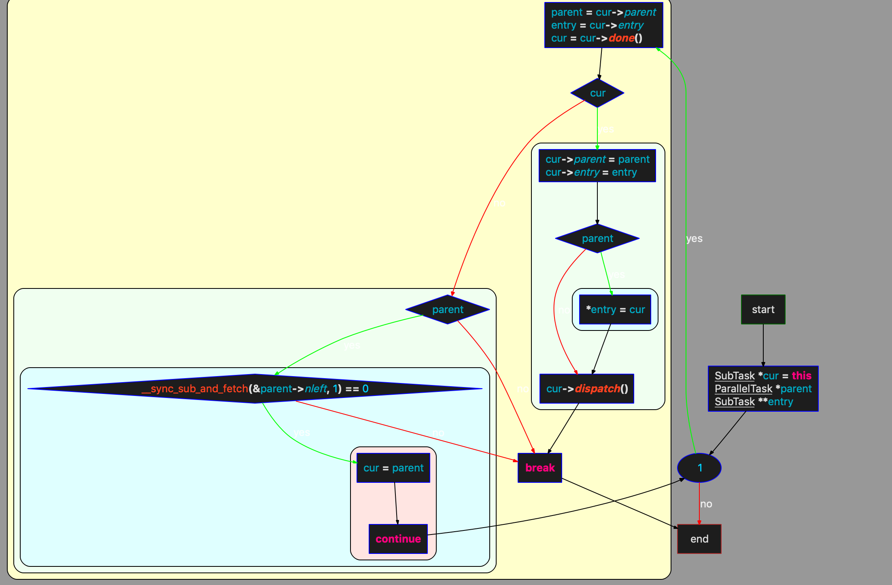

# workflow 源码解析 : SubTask && Series 

更加详细的源码注释可看 : https://github.com/chanchann/workflow_annotation



### 简单的demo

```cpp
#include <workflow/Workflow.h>
#include <workflow/WFTaskFactory.h>
#include <workflow/WFFacilities.h>

int main()
{
    WFTimerTask *task = WFTaskFactory::create_timer_task(3000 * 1000,    
    [](WFTimerTask *timer)
    {
        fprintf(stderr, "timer end\n");
    });

    task->start();
    getchar();
    return 0;
}
```

我们之前分析了timerTask, 我们先用这个简单的task来分析一番workflow的task是如何组织的。

workflow最为基本的运行逻辑，就是串并联，最为简单的运行模式就是一个Series串联起来依次执行。

### 运行起来

我们先来看看task如何运行起来的，我在创建出task后，start启动
```cpp
class WFTimerTask : public SleepRequest
{
public:
	void start()
	{
		assert(!series_of(this));
		Workflow::start_series_work(this, nullptr);
	}
    ...
};
```

我们所有的task都要依赖在series中进行，所以我们不能让这个裸的task执行，先给他创建series_work

```cpp
inline void
Workflow::start_series_work(SubTask *first, series_callback_t callback)
{
	new SeriesWork(first, std::move(callback));
	first->dispatch();
}
```

## 创建SeriesWork

我们先来观察一下SeriesWork的结构

```cpp
class SeriesWork
{
....
protected:
	void *context;
	series_callback_t callback;
private:
	SubTask *first;  
	SubTask *last;   
	SubTask **queue;  
	int queue_size;
	int front;
	int back;
	bool in_parallel;
	bool canceled;
	std::mutex mutex;
};
```

看的出，是一个queue，也很容易理解，我们把任务装到一个队列里，挨着挨着执行。

我们在new 构造的时候，初始化一下

```cpp
SeriesWork::SeriesWork(SubTask *first, series_callback_t&& cb) :
	callback(std::move(cb))
{
	this->queue = new SubTask *[4];
	this->queue_size = 4;
	this->front = 0;
	this->back = 0;
	this->in_parallel = false;
	this->canceled = false;
	first->set_pointer(this);
	this->first = first;
	this->last = NULL;
	this->context = NULL;
}
```

这里我们注意两点:

1. this->queue = new SubTask *[4]; 

先预留出来4个空间

2. first->set_pointer(this)

把subTask和这个SeriesWork绑定了起来

3. 这里front和back都为0，我们不把first task算在task里，而是用first指针单独存储(首位都较为特殊，都单独存储)

## dispatch

引出本节的重点

```cpp
first->dispatch();
```

我们的SubTask是workflow所有task的爷，他的核心就三个函数

```cpp
class SubTask
{
public:
	virtual void dispatch() = 0;

private:
	virtual SubTask *done() = 0;

protected:
	void subtask_done();
    ...
};
```

其中dispatch和done是纯虚函数，不同的task继承实现不同的逻辑。

dispatch代表任务的发起，可以是任何行为，并且要求任务在完成的时候调用subtask_done方法，一般这时候已经不在dispatch线程了。

done是任务的完成行为，你可以看到subtask_done里立刻调用了任务的done。done方法把任务交回实现者，实现者要负责内存的回收，比如可能delete this。done方法可以返回一个新任务，可以认为原任务转移到新任务并且立刻dispatch，所以return this也是一个常见做法。

我们可以对比两个例子


