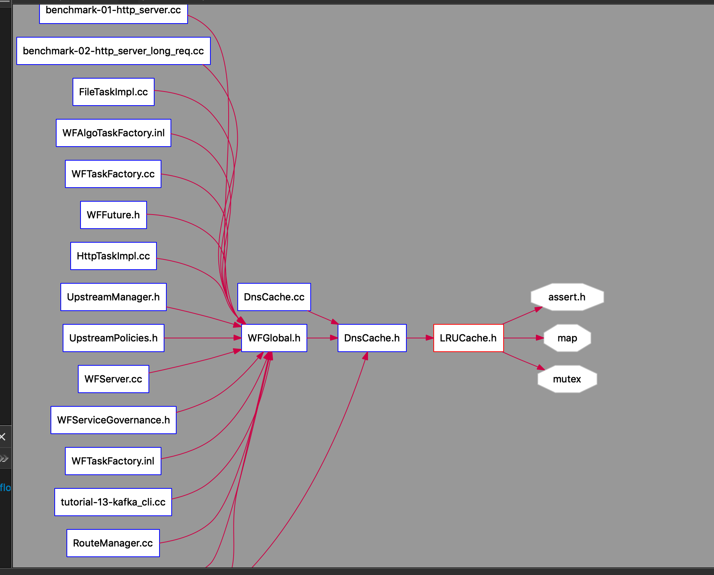
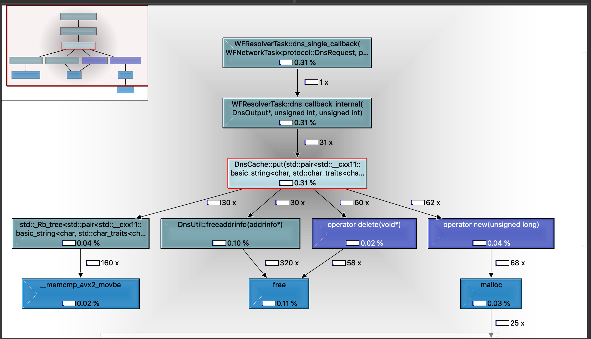
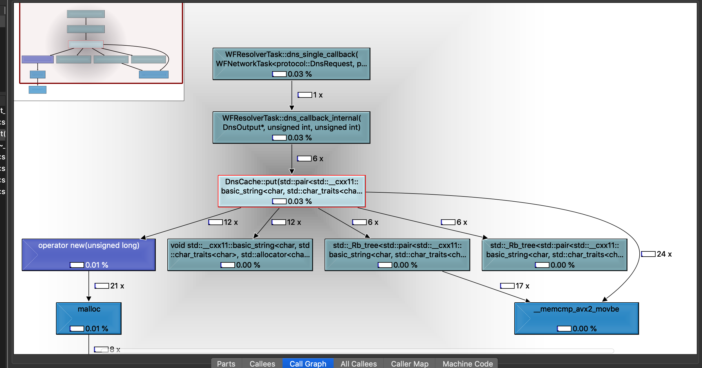

# workflow杂记02 : cache size 分析

https://github.com/sogou/workflow/commit/1736d64d91c8b54c533a6e949354bee5566d6e2c

https://github.com/sogou/workflow/issues/590

项目源码 : https://github.com/sogou/workflow

更加详细的源码注释可看 : https://github.com/chanchann/workflow_annotation

## cache size 

default max_size=0 means no-limit cache

max_size means max cache number of key-value pairs

dns cache最大值设为了1，相对于让整个dns cahce完全失效

## 实验

我们先看看Dns Cache哪里会用到上



我们选择一个简单的demo来写，通过http task，来调用DnsCache

## 代码

```cpp

#include <workflow/Workflow.h>
#include <workflow/WFTaskFactory.h>
#include <workflow/WFFacilities.h>

using namespace protocol;

void http_callback(WFHttpTask *task)
{
    HttpRequest *req = task->get_req();
    HttpResponse *resp = task->get_resp();
    fprintf(stderr, "req uri : %s, resp status : %s\n",
                 req->get_request_uri(), resp->get_status_code());
}

WFHttpTask *create_http_task(const std::string &url)
{
    return WFTaskFactory::create_http_task(url, 4, 2, http_callback);
}

int main()
{
    std::vector<std::string> url_list = {
        "http://www.bing.com",
        "http://www.tencent.com",
        "http://www.sogou.com",
        "http://www.baidu.com", 
    };

    WFHttpTask *first_task = create_http_task("http://www.baidu.com");

    WFFacilities::WaitGroup wait_group(1);
    auto series_callback = [&wait_group](const SeriesWork *series)
    {
        fprintf(stderr, "All tasks have done");
        wait_group.done();
    };
    SeriesWork *series = Workflow::create_series_work(first_task, series_callback);
    for(int i = 0; i < 5; i++) 
    {
        for(auto& url : url_list) 
        {
            series->push_back(create_http_task(url));
        }
    }   
    series->start();
    wait_group.wait();
}
```

## 然后我们修改max_size_ 对比

```
public:
	LRUCache():
		max_size_(1),
		// max_size_(0),
		size_(0)
	{
		not_use_.next = &not_use_;
```

## max_size_(0)



可见调用 x6

## max_size_(1)



可见调用 x31

可见此处调用put的次数，完全没有存cache，每次都要重新put


